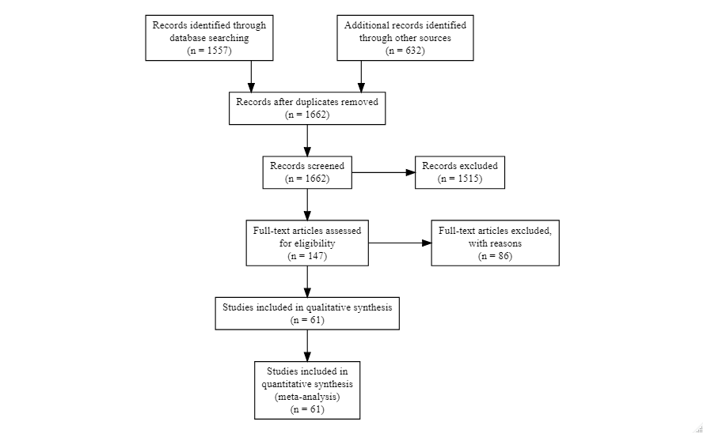

```{r setup, include=FALSE}
knitr::opts_chunk$set(echo = TRUE)
library(papaja)
library(kableExtra)
library(tidyverse)
# r_refs("../r-references.bib")
# Read in data files for tables
table_1 <- readr::read_csv("table1.csv")
table_2 <- readr::read_csv("table2.csv")
```

In their seminal review, @Bilodeau1961 proclaimed feedback as the most impactful variable contributing to motor learning and performance, stating “... there is no improvement without [feedback], progressive improvement with it, and deterioration after its withdrawal” (p.250). @Salmoni1984 agreed that feedback is a critical determinant of motor performance, but suggested ironic effects on motor learning. In what is now widely regarded as the “Guidance Hypothesis,” Salmoni et al suggested that feedback functions much like physical guidance, influencing motor performance toward the goal outcome but undermining the development of intrinsic error detection and correction processes that ostensibly underlie sustained motor learning. A key prediction of the guidance hypothesis is that providing feedback following each trial enhances performance during acquisition but degrades performance on a no-feedback retention test, relative to providing feedback at a reduced relative frequency. Although the primary tenets of the guidance hypothesis have been widely accepted in some form by motor learning researchers [e.g., @Lee2021; @Magill2012; @Ong2020; @Sigrist2013], experimental evidence has been mixed, fueling debate with respect to the optimal scheduling of feedback for motor learning [e.g., @Wulf2016; @Wulf2004]. 

While feedback is a term that can capture a wide range of information sources, the guidance hypothesis focused on a specific type of feedback: augmented, terminal feedback about the success of the trial with respect to the goal [@Salmoni1984]. Feedback can broadly be divided into two types: intrinsic and extrinsic [@Schmidt2018]. Intrinsic feedback arrives to the learner through their own senses. For example, an archer receives visual intrinsic feedback of the outcome of her shot through her own vision of the arrow and the target. Conversely, extrinsic feedback is provided to the learner by an external source. Since extrinsic feedback is in addition to one’s intrinsic feedback, it is often called augmented feedback. As an example, a baseball pitcher could receive augmented feedback about their fastball velocity from a radar gun. Augmented feedback can be further divided based on the timing of its presentation; where concurrent feedback is provided during the performance and terminal feedback is provided following the performance. When a video game shows the player the positioning of their joysticks in real time, the game is providing concurrent feedback.  Conversely, when a cricket coach tells her player that their swing was too late, they are providing terminal feedback. Like the guidance hypothesis, the present research is restricted in scope to augmented, terminal feedback.

One of the most influential aspects of the guidance hypothesis is the prediction of a “reversal effect”: The relative effectiveness of a 100\% feedback frequency in comparison to a reduced frequency is predicted to reverse from acquisition to no-feedback transfer tests (called retention tests hereafter). Putative reversal effects are commonly referenced as a central reason to explain why modern motor learning researchers focus on retention tests, rather than performance curves [@Kantak2012; @Lee2021; @Salmoni1984; @Schmidt2018]. Further, delaying retention tests for at least 24-hours to allow for a night of sleep between acquisition and testing have been advocated as the minimum standard for assessing relatively permanent changes in motor skill [@Kantak2012]. In their influential review, Kantak and Winstein investigated experiments that manipulated practice or feedback conditions during acquisition and included both an immediate and delayed retention or transfer test. Of the included experiments, studies that manipulated feedback were the most common. Based on a vote-counting comparison of statistical significance at each time point, Kantak and Winstein concluded that immediate and delayed retention tests often produced conflicting results. A weakness of the vote-counting method in this context is that the difference between significant and non-significant is not necessarily significant itself [@Gelman2006]. A more rigorous approach to determining if the effect of a practice method changes from immediate to delayed retention is multilevel/multivariate meta-analysis [@VandenNoortgate2015]. 

The reversal predicted by the guidance hypothesis, and widely accepted in at least some contexts, is from acquisition performance when feedback is present to retention performance when it is not [@Lee2021; @Magill2012; @Salmoni1984; @Sigrist2013]. In a meta-analysis of studies conducted as of 2001, @Marschall2007 reported a significant benefit for a 100\% feedback frequency during acquisition and a significant benefit to a reduced feedback frequency at delayed retention. While these results are suggestive, the authors highlighted that the primary findings were not robust. Based on a Fail Safe *N* analysis, only two or three zero-effect results missing from the sample would have made their findings non-significant. Studies may have been missing from the sample due to preferential publication of positive, statistically significant results, a practice that can distort the scientific literature. Such a distortion is often called publication bias [@Dickersin1987]. This is notable as the authors suggested publication bias may have impacted their results, highlighting that statistics for non-significant results were not reported nor discussed in their sample. Critically, the authors included multiple outcomes and multiple reduced frequency group comparisons in their analysis without accounting for the dependency among the effect sizes; this practice has the effect of incorrectly reducing variance estimates and inflating the Type 1 error rate [@Borenstein2021; @Scammacca2014]. Considering these issues, the evidence in favor of both 100\% feedback for acquisition and reduced frequencies for delayed retention seems tenuous. Further, @Marschall2007 did not statistically compare acquisition, immediate retention, and delayed retention time points, as would be required for substantive conclusions regarding reversal effects.

Save for the meta-analysis reported by @Marschall2007, the feedback frequency literature has only been synthesized qualitatively. Nevertheless, there is an apparent consensus that providing feedback 100\% of the time during acquisition a) guides learners to the correct response, b) can create a dependency on feedback, and c) blocks intrinsic error detection and correction processes [@Lee2021; @Magill2012; @Schmidt2018; @Sigrist2013; @Winstein1991; @Wulf2004]. The present meta-analysis provides a current, rigorous, and quantitative examination of the reduced feedback frequency literature, addressing the effectiveness of reduced frequencies of feedback for acquisition, immediate retention, and delayed retention performance.  Further, potential changes in effectiveness from acquisition to delayed retention and from immediate retention to delayed retention were evaluated using multilevel meta-analytic methods. 

The primary objectives of this research were as follows: 1) estimate the effect of providing a reduced frequency of terminal feedback on acquisition, immediate retention, and delayed retention of motor skills in a healthy population, 2) investigate whether the effect of reducing terminal feedback frequency changes from immediate to delayed retention, 3) investigate whether the effect changes from acquisition to delayed retention, and 4) investigate the influence of publication bias on the primary meta-analysis. To this end, we restricted our primary analyses to experiments that manipulated feedback frequency directly and included a 100\% frequency comparison group. Experiments that manipulated frequency via trial delay, summary, or statistical methods (i.e., average) were not included. Experiments that manipulated frequency in performance or participant contingent ways, such as bandwidth or self-controlled scheduling, were also excluded, although studies that included a bandwidth group and a 100\% frequency group were collected to test whether bandwidth scheduling has advantages over fixed scheduling schemes. We limited the scope of the primary analyses to experiments that directly manipulated feedback frequency in an effort to limit heterogeneity in true effects.

In line with our primary objectives, we sought to test the following primary hypotheses (quoting directly from our preregistration, https://osf.io/hgba7/?view_only=9e6816867b8c4d6c8cd6ebb7929097d5): \blockquote{1)	Based on the guidance hypothesis [@Salmoni1984]: A reduced frequency of feedback during acquisition will result in superior performance on a delayed 24-hour retention test. 
2)	Based on the guidance hypothesis: A reduced frequency of feedback during acquisition will result in superior performance on an immediate, no feedback retention test. 
3)	Based on the guidance hypothesis: A 100\% frequency of feedback will result in superior performance during acquisition.
4)	Based on the guidance hypothesis: The effect of feedback frequency will change from acquisition to delayed retention, such that 100\% feedback is more effective for acquisition performance but less effective for delayed retention performance
5)	Based on the @Kantak2012 motor memory paradigm: The effect of feedback frequency will change from immediate retention to delayed retention, such that the benefit of reduced feedback frequency will increase from immediate to delayed retention. 
6)	Based on our assessment of the motor learning literature: There will be evidence of significant selection effects around $p = .025$ (one-tailed), such that studies reporting statistically significant results will be overrepresented in the sample.}

We restricted our focus on feedback frequency manipulations only to limit heterogeneity of results as much as possible. Nevertheless, feedback frequency experiments have been conducted with various samples and with a multitude of tasks, feedback frequencies, practice amounts, and types of feedback content. Therefore, we anticipated some heterogeneity in the results and planned to test a variety of potential moderators to account for this heterogeneity. Thus, our secondary objectives were to test the following potential moderators: age group (children, adult, older adult), skill level (novice, experienced, expert), task classification (based on Gentile’s 2 X 2 framework), number of acquisition trials, number of acquisition days, frequency of terminal feedback, publication status (published, unpublished thesis), bandwidth provisioning (yes, no), faded feedback schedule (yes, no).

In line with our secondary objectives, we tested the following secondary hypotheses (again quoting directly from our preregistration, https://osf.io/hgba7/?view_only=9e6816867b8c4d6c8cd6ebb7929097d5): \blockquote{1)	Based on the Challenge-Point Framework [@Guadagnoli2004]: Children and older adults will perform more effectively on delayed retention tests after having practiced with 100\% feedback during acquisition, while younger adults will perform more effectively after having received a reduced frequency of feedback. 
2)	Based on research comparing bandwidth feedback protocols to yoked groups: Providing feedback according to a bandwidth will have a larger benefit for delayed retention performance than reduced feedback frequency. 
3)	Based on the guidance hypothesis: A faded schedule of feedback during acquisition will be more effective than a static reduced schedule of feedback for delayed retention performance.}

In addition to testing our primary and secondary hypotheses, we also considered the possibility we would fail to observe effects large enough to be interesting. We defined our smallest effect size of interest as $g = .10$.[^1]

[^1]: We chose an effect of .10 as the smallest effect we would be interested in because it is half the size of the traditional benchmark for a small effect size [@Cohen1988]. Future efforts to define a smallest effect of interest should be more principled and theory-driven.  

# Method

The Preferred Reporting Items for Systematic Reviews and Meta-Analyses (PRISMA) guidelines were adhered to while preparing this meta-analysis and the completed checklist can be found in the supplemental data [@Page2021]. Each step of the search, selection, data collection, and bias assessment process was completed by pairs of researchers working independently, unless otherwise specified (XX + XX, XX + XX, XX + XX). In case of conflicts, the senior researcher from another pair (either XX or XX) independently resolved the conflict.


## Eligibility Criteria

### Population 

Experiments were eligible for inclusion if the participants were sampled from a healthy population of adults or children. We excluded studies that included clinical populations as results may not generalize.

### Intervention

We included experiments that randomly assigned participants to a 100% terminal augmented feedback group and a set reduced frequency of terminal augmented feedback group.  

### Outcomes

To be included, experiments needed to include an objective measure of motor skill performance collected as an immediate and/or delayed retention test. The retention tests followed the acquisition phase after an interval of time and involved the same task parameters as acquisition trials, but no augmented feedback was provided. Experiments that included only a transfer test (performance of a task that required different task parameters for success) were not included.

### Additional Restrictions on Eligibility

We required studies to be published in peer reviewed journals or be an accepted masters or doctoral thesis to ensure the results were complete and had passed an initial quality screening. Further, we required the studies be available in English due to limited language knowledge in other languages by members of the research team.

## Information Sources, Search Strategy, and Selection Process

On August 5th, 2020 XX and XX searched PubMed and PsycInfo databases for “feedback” AND “motor learning” and returned the same number of hits. XX imported the results into Covidence. Initial results from the database search were screened based on title and abstract in Covidence. The full-text of articles that were not excluded based on title and abstract were then screened. When full-text screening revealed an article was not eligible for inclusion, the reason for exclusion was recorded in Covidence. Subsequently, the reference sections of identified eligible articles were reviewed and any potentially eligible titles were searched in Google Scholar, a process known as backward tracing. Next, forward tracing was conducted using the “cited by” feature on Google Scholar to search all papers that had cited articles identified as eligible. We repeated this process a second time with any eligible papers that were found via forward or backward reference tracing. Finally, a targeted author search was performed in Google Scholar for any author with at least two papers identified as eligible for inclusion. The final paper uploaded to Covidence occurred on September 1st, 2020, representing the end date of our search process. 

### Data Collection Process

Data were collected using a data collection form we developed through early piloting. The collection form can be found at the OSF database. The form was created in Excel and used restricted data entry to ensure consistent coding terms. The data collection form was updated during data collection when an unanticipated error measure was encountered (see Deviations from Pre-Registration below for exhaustive review of deviations from pre-planned procedures). 

Outcome data were extracted according to a prespecified hierarchy. When available, means and standard deviations were selected for each outcome of interest at each time point of interest. If standard deviations were unavailable standard errors were selected. When means were unavailable, *F* statistics (or *t* statistics) were extracted. When an analysis of covariance was the primary analysis reported, the *F* statistic and the correlation between the covariate (pre-test in all instances) and the outcome measure was extracted.  

After all conflicts between researcher pairs had been resolved, XX combined the data from the three pairs of researchers into a comma separated master datafile. Version control was ensured by saving changes to the master file as a new, date-specific file. Frequently, articles did not provide sufficient detail to code for moderators or extract data required for calculation of effect size estimates. When data were missing, AMO, HB, and MV contacted corresponding authors and requested access to the raw data or the specific data that were unavailable. If no response was received, a follow-up email was sent approximately one month after the first attempt. If the authors were able to provide the requested data, XX added it to the master data file in an updated version. 

If outcome data were still missing after outreach to authors, figures that included error bars were digitized using WebPlotDigitizer 4.4 [@Rohatgi2020]. The digitization process produced values that were precise to the pixel, therefore absolute agreement between independent coders was rare. Typically, results between coders were similar and when large conflicts were identified those results were re-digitized. Each value was averaged across coders and XX added the mean result to an updated version of the master data file. 

### Data Items

#### Outcomes Collected

We sought objective measures of motor skill performance for inclusion in the meta-analysis. Such measures included error scores, such as absolute error and variable error, as well as outcome measures such as movement time and movement form. We expected many studies would report multiple outcome measures at multiple time-points. For example, an individual study might report results for absolute error, variable error, and movement form, each at acquisition, immediate retention, and delayed retention. For our primary analyses, we selected the outcome measure that corresponded to the information provided as feedback during acquisition. For example, if participants received feedback about their absolute timing error during acquisition, then absolute timing error was the primary outcome measure of interest.  We focused on acquisition, immediate retention, and delayed retention timepoints for our primary analyses, although if delayed transfer tests were reported we extracted those data as well.   If feedback did not map directly onto an outcome measure, then we followed a preregistered priority list to select the most relevant outcome available, ordered as: (1) absolute error, (2) root mean square error, (3) absolute constant error, (4) total error, (5) absolute timing error, (6) relative timing error, (7) variable error, (8), movement time, (9) movement form – expert raters, and (10) otherwise unspecified objective performance measure reported first in research report.

In addition to the primary dependent measure of interest, up to two additional outcome measures were collected if reported. When more than two additional outcomes were reported, we used the priority list to select the two most relevant outcomes. Secondary outcomes were analyzed as part of a series of sensitivity analyses to evaluate the impact of our dependent measure selection on the conclusions drawn from the primary analyses.

If feedback frequency was an independent variable in a factorial design, we coded the main effect of feedback frequency if it did not interact with a second independent variable. If there was a statistically significant interaction at any timepoint, then we extracted the simple effects of feedback frequency at all timepoints for a given study. We excluded simple effects for levels of a second independent variable that moderated the effect of feedback frequency by including an additional, atypical element to the practice condition. For example, if an experiment crossed feedback frequency with real and sham transcranial direct current stimulation, we selected only the simple effects from the sham condition. When the same experiment included multiple reduced frequency of feedback groups, we collected data for all groups and selected the lowest non-zero frequency for primary analyses. If an experiment included multiple groups with the same frequency of feedback, we selected the group that followed a fixed, uniformly distributed schedule of feedback if one was present. 

#### Moderators Collected

Information pertaining to moderator variables was also collected from each article (or thesis). We collected data on the following: (1) article features (authors, year, publication status, and experiment number), (2) experiment features (number of trials, days of acquisition, immediate retention delay interval in minutes, delayed retention interval in days), (3) task features; coding was based on Gentile’s [@Gentile2000] taxonomy of tasks, resulting in four combinations that arose from the regulatory context (stable, in-motion) and inter-trial variability (constant, variable), (4) participant features (age: child, adult, older adult; and skill level: novice, experienced, expert), (5) feedback features (frequency, content, whether provided with a faded schedule, and whether provided with a bandwidth mechanism) and (6) the outcome measure as outlined above. 

## Risk of Bias Assessment Process

Risk of bias for each study was evaluated using the Cochrane Risk of Bias 1.0 checklist [@Higgins2011]. Judgments were made about seven dimensions of potential risk of bias: Sequence generation, allocation concealment, blinding of participants and personnel, blinding of outcome assessment, incomplete outcome data, selective reporting of results, and other sources of bias. Each dimension received one of three judgments: Low risk, unclear, or high risk. Selective outcome reporting is difficult to evaluate by its very nature, so we defaulted to the methodological details provided by the authors and the clarity of their reporting. Typically, risk of selective outcome reporting was deemed as unclear unless the authors were explicit about collecting data that were unreported, or explicit that all data were reported. The “other sources of bias” dimension captured concerns that were shared among the authors of this review, such as if the original data analysis and/or interpretation in a paper was problematic. Each dimension of the risk of bias assessment was tested as potential moderator of the overall effect of reduced feedback frequency across time points in a series of exploratory analyses. 

## Effect Measures

We calculated the standardized mean difference between 100\% frequency and reduced frequency feedback groups for analysis. Specifically, we calculated Hedges’ *g* estimates and their variance using the `compute.es` package in `R` [@DelRe2013]. 

## Synthesis Methods

### Preparing Data for Synthesis

If multiple groups could not be differentiated with respect to frequency, distribution, or pre-determinacy of schedule, those groups were combined using the Cochrane formula for combining independent groups (https://handbook-5-1.cochrane.org/chapter_7/table_7_7_a_formulae_for_combining_groups.htm). We converted standard errors to standard deviations before combining groups or calculating effect sizes by multiplying the standard error by the square root of the sample size ($SD  = SE*\sqrt{n}$).

When data were reported as group means and standard deviations for multiple acquisition or retention blocks, the raw data were required to combine those blocks due to the dependent nature of the data. When the raw data were not available for the acquisition phase, that timepoint was omitted from further analysis.  If immediate retention, delayed retention, or transfer test data included multiple blocks that were not combined, means and standard deviations from the first block were selected for analysis. 

### Influential Case Analysis

In order to evaluate whether specific data points were excessively influential at a given timepoint, the following influence statistics were calculated using the `metafor` package in `R` [@Viechtbauer2010]: externally standardized residuals, Cook's distances, and covariance ratios. If any effect had been identified as extremely influential by the default cut-offs for these tests in ‘metafor’, it would have been removed from the primary analyses. However, no influential cases were identified with this procedure.

To evaluate influential cases in the multivariate analyses, Cook’s distances were calculated and values greater than .50 were considered influential. One influential case was detected, and analyses were conducted with and without the case included. None of the results changed substantively based on the inclusion or exclusion of the influential case. 

### Meta-analysis Models

The primary research questions in this study were addressed by fitting multilevel random/mixed-effects models to the data with random effects for experiment and tests within experiments to account for dependencies in the underlying true effects. Our approach to the analysis involved four steps. First, univariate random effects models were fit for acquisition, immediate retention, and delayed retention time points. These univariate models were used to fit three-point selection models with a one-tailed *p*-value cutoff of .025 to evaluate and correct for the impact of selection bias around statistical significance [@Vevea2005]. Second, the average effect of reduced feedback frequency at acquisition, immediate retention, and delayed retention was estimated by fitting a multilevel model with test nested in experiment. Third, the change in effect from acquisition to delayed retention was tested by comparing only those two coefficients in the model. Fourth, the change in effect from immediate retention to delayed retention was evaluated by testing only those two coefficients in the model. The correlation in sampling errors was not included in the primary models as simulation studies have suggested that multilevel models automatically account for this dependency in the correlation between true effects [@VandenNoortgate2015]. Heterogeneity was evaluated based on restricted maximum likelihood (REML) calculation of $\small\tau^2$ and 95\% prediction (credibility) intervals. 

### Moderator Analyses

Categorical moderators were included one at a time in multilevel mixed-effects models that allowed the moderator to interact with time point.  Similarly, meta-regressions with each continuous moderator were included separately. Cochrane’s *Q-M* test was used to evaluate whether moderators accounted for a significant amount of residual heterogeneity. 

### Sensitivty Analyses

Several sensitivity analyses were conducted to evaluate the extent to which our findings depended on the specific analysis decisions we chose.  These sensitivity analyses spanned three main areas: model selection, multivariate dependencies, and selection bias assessment (further discussed in the section below). To evaluate the impact of selecting only a single primary outcome measure rather than including all outcome measures reported, we fit a multilevel model with measure nested within time nested within study. We proceeded to evaluate each moderator with this alternative model specification. The results of these analyses did not lead to different conclusions from the primary analyses (see Supplemental data). 

In order to assess the robustness of our multivariate models,  we refit our primary models using cluster-robust inference methods as well as approximating the covariance matrix by using known intra-class correlation values from within the sample [@Pustejovsky2020]. The results of these sensitivity analyses were not markedly different from the main analyses reported below (see Supplemental Data).

### Selection Bias Assessment

Our preregistered primary method of assessing and correcting for publication bias was the Vevea-Hedges three-point weight function model with a cutoff at *p* = .025 (one-tailed) fit to each time point. Further, we planned to evaluate a suite of bias correction methods under a range of plausible circumstances and fit all models with good performance. This method performance check was conducted using the Meta-Showdown Explorer shiny app (https://tellmi.psy.lmu.de/felix/metaExplorer/?). The largest amount of heterogeneity that could be tested on the app was $\small\tau = .4$, which is potentially much less than exists in the present meta-analysis. We therefore chose to apply recently developed methods not covered by the Meta-Showdown Explorer that may be more robust in the presence of high heterogeneity.  Specifically, we conducted a robust Bayesian meta-analysis (RoBMA), which fitted 12 models to the data and averaged across them [@Maier2020], resulting in estimates that were robust to misspecification and perform well in simulations with relatively high heterogeneity.  Additionally, a *z*-curve was selected to model potential selection based on statistical significance [@Bartoš2020].  *Z*-curve uses only statistically significant findings and estimates the distribution of non-significant values, many of which may be missing from the dataset due to selection. Unlike other methods that can calculate corrected effect estimates, *z*-curve uses a finite mixture model of seven distributions and, therefore, it does not attempt to estimate a true average effect. Instead, *z*-curve can be used to estimate conditional power: the probability that replication attempts of included (significant) studies will succeed, termed the expected replication rate (ERR). Further, *z*-curve also produces an estimate of unconditional power: the probability that any given study that has been conducted (published or not) would produce a significant result, termed the expected discovery rate (EDR). The delayed retention time point was considered the primary target for a significant finding in motor learning research and previous research has found substantial selection at that time point [@McKay2021]. As such, we focused both the RoBMA and *z*-curve analyses on delayed retention results.

### Certainty Assessment

Our focus was on the confidence and especially prediction intervals of the estimates produced by our models. Prediction intervals tell us the range of effects we would expect to observe if we randomly sampled an experiment from the same population of experiments that were sampled in the analysis [@IntHout2016].

# Results

## Study Selection

We found 1,030 records through database searching after removing duplicates. We subsequently retrieved an additional 632 articles via backward and forward citation searches as well as a targeted author search. A total of 1662 articles were screened, resulting in full-text reviews of 147 articles. A total of 61 articles were selected for analysis (see Figure \@ref(fig:fig1)).

(ref:fig1-caption) Flow Diagram of Study Selection.

```{r fig1, echo = FALSE, fig.cap = "(ref:fig1-caption)", fig.align = "center", fig.height=800, fig.width=800, out.height = "150%", out.width="125%"}

```

## Study Characteristics

Study characteristics and effect sizes for all studies included in the meta-analysis are presented in Table \@ref(tab:table1).

```{r table1, echo=FALSE, results="asis"}
kbl(table_1,
    longtable = TRUE,
    booktabs = TRUE,
    escape = TRUE,
    linesep = "\\addlinespace",
    caption = "Characteristics and Effect Sizes of Included Studies."
    ) %>%
  landscape() %>%
  kable_styling(position = "left",
                latex_options = "repeat_header",
                font_size = 10) %>%
  footnote(general = "n100 = sample size for 100% feedback group; n2 = sample size for reduced frequency group; Var = variance of Hedges' g estimate. Only data from primary measures are presented.",
           general_title = "Note.",
           threeparttable = TRUE)
```

## Risk of Bias

An overall summary of the risk of bias assessment can be seen in Figure \@ref(fig:fig2). Outliers and attrition were rarely mentioned in the articles reviewed, resulting in 88.5% of studies receiving a high risk of bias rating in the "Incomplete Outcome Data" dimension. There was also a lack of clarity in the included studies regarding allocation concealment, the comprehensiveness of their outcome reporting, and measures taken to blind participants and research personnel during data collection. A substantial number of studies included unblinded outcome assessors. Conversely, most studies were explicit about the use of random assignment and tended to lack other reasons for concern. Each dimension was tested as a possible moderator, but none accounted for a significant proportion of the heterogeneity in effect sizes.

(ref:fig2-caption) Risk of Bias Assessment Summary

```{r fig2, echo = FALSE, fig.cap = "(ref:fig2-caption)", fig.align = "center", out.height = "60%"}
knitr::include_graphics("../../figures/fig2.pdf")
```

## Results of Synthesis

(ref:fig3-caption) Forest Plot of Effect Sizes and Univariate Estimates of Effect Sizes at Each Time Point. Black polygons represent 95% confidence intervals and error bars represent 95% prediction intervals.

```{r fig3, echo = FALSE, fig.cap = "(ref:fig3-caption)", fig.align = "center", out.height = "150%"}
knitr::include_graphics("../../figures/fig3.pdf")
```

### Aquisition

Hedges’ *g* values ranged from -1.27 to 1.59 at acquisition, with a mean effect size of .16 as estimated by a univariate random effects model.  The average effect as estimated by a multilevel model was .19, with the 95% confidence interval (CI) ranging from -.11 to .49. There appeared to be substantial heterogeneity among the true effects (*Q* = 240.5, *df* = 67, *p* < .0001), with the larger part of the heterogeneity due to differences between studies ($\hat{\small\sigma}$~1~ = .2462) as well as substantial heterogeneity between time points ($\hat{\small\sigma}$~2~ = .1188). The 95% prediction interval for the effect of reduced feedback frequency at acquisition ranged from -1.03 to 1.42, encompassing effect sizes that are very large in both directions. These results suggest that the effect of reduced feedback frequency may differ widely from study to study, and we cannot be confident in which direction the effect will be on average.

### Immediate Retention

Hedges’ *g* values ranged from -1.51 to 1.36 at immediate retention. According to the univariate model, the average effect was .05, while the multilevel model estimated the effect as .01 with the 95% CI ranging from -.30 to 32. The 95% prediction interval ranged from -1.21 to 1.24. Again, these results suggest the effect at immediate retention may vary from very large benefits for reduced feedback frequency to very large benefits for 100% feedback frequency. As with the acquisition results, we cannot be confident in the direction of the average effect at immediate retention. 

### Delayed Retention

The Hedges’ *g* values at delayed retention ranged from -2.14 to 1.92. The average effect size as estimated by the univariate model was .16, while the multilevel model estimated an average effect of .19. The 95% CI of the multilevel estimate was -.05 to .43 and the 95% prediction interval was -1.02 to 1.40. In line with the previous two time points, these results suggest that any individual study may find results ranging from very large effects in favor of a reduced feedback frequency to very large effects in favor of a 100% frequency. Again, we cannot be confident in the average direction of the true effects at delayed retention.

### Acquisition vs. Delayed Retention

The difference in Hedges’ *g* between acquisition and delayed retention time points was estimated as -.0008 (smaller effect at delayed retention) by the multilevel model. The 95% CI ranged from -.32 to .32, suggesting we cannot be confident in the direction of the average difference between time points, if such a difference exists. 

### Immediate vs. Delayed Retention

The difference between immediate and delayed retention was estimated as .18 (larger effect at delayed retention) by the multilevel model, with a 95% CI ranging from -.16 to .52. These results suggest we cannot be confident in the direction of the average difference between immediate and delayed retention, if such a difference exists. 

### Categorical Moderators

The following moderators failed to account for a significant proportion of the heterogeneity in effect sizes: age (child vs. adult; *p* = .28), skill level (novice vs. experienced; *p* = .61), whether the feedback schedule was faded (faded vs. not-faded; *p* = .60), whether the reduced frequency group was yoked to another group (yoked vs. not-yoked; *p* = .21), the type of feedback provided (absolute timing error, constant error, form, other-precise, other-qualitative, relative timing error, root mean square error; *p* = .90), and the measure included (absolute timing error, absolute constant error, absolute error,  total error, form, other, relative timing error, variable error; *p* = .26). 

The task-type moderator (in motion-constant, stable-constant, stable-variable) significantly interacted with time point (*Q-M* = 16.75, *df* = 8, *p* = .033). Further inspection revealed that only two studies included an “in motion-constant” task, one of which [@Drews2021] reported the largest effect size in the dataset at delayed retention (*g* = -2.14).  Removing this single effect resulted in the moderator analysis no longer detecting a significant effect of the task-type moderator (*p* = .37). 

Bandwidth feedback protocols were not included in the primary analyses, so a special moderator analysis was conducted with bandwidth effects added to the dataset. There was no significant difference between bandwidth and non-bandwidth reduced feedback frequencies at any time point (*p* = .61).

### Meta-regression Models

Continuous moderators were included separately in multilevel meta-regression models including an interaction with time point. None of the following moderators accounted for a significant proportion of the heterogeneity in effect sizes: number of acquisition trials (*p* = .13), number of acquisition days (*p* = .20), relative feedback frequency (*p* = .73), immediate retention interval (in minutes – only immediate and delayed time points tested; *p* = .64), delayed retention interval (in days – only delayed retention time point tested; *p* = .61). 

An additional analysis of feedback frequency was conducted by including effects from studies that contained multiple feedback frequency groups. Since all feedback frequency groups in a given study share the same 100% comparison group, the sample size of the 100% groups in such studies was divided by the number of comparisons in an (imperfect) effort to avoid double counting participants [@Higgins2019]. Feedback frequency was not a significant moderator in the analysis (*p* = .42).

### Selection Bias

Weight-function selection models were fit at each time point as the primary preregistered method for addressing publication bias. The selection model estimated the average effect at acquisition as *g* = .02, 95% CI [-.44, .48] and found that non-significant results were 51% as likely to survive selection as significant results. The likelihood ratio test found that the selection model did not provide a significantly better fit to the data than the naïve random effects model, *p* = .47. 

There was only one significant result in favor of a reduced frequency of feedback at immediate retention, while there were two significant results in favor of 100% feedback. As such, a two-sided selection model with a .05 cut point was fit to the immediate retention data. The model estimated the average effect as *g* = .07, 95% CI [-.44, .57], but the likelihood ratio test did not indicate a significantly better fit for the selection model, *p* = .302.

The selection model estimated the average effect at delayed retention as *g* = .06, 95% CI [-.30, .42] and found that non-significant results were 63% as likely to survive selection as significant results. Again, the likelihood ratio test failed to find a significant improvement in fit for the selection model compared to the naïve random effects model, *p* = .526.

The results of the RoBMA analysis of delayed retention data estimated the mean effect of reduced feedback frequency as *g* = .021, with a 95% credible interval of -.062 to .279. The analysis found moderate evidence for an absence of an effect of reduced feedback frequency, suggesting the data were over 4 times more likely under the null model (BF01 = 4.22). The analysis also found weak evidence against the existence of publication bias (BF01 = 1.8), and very strong evidence of heterogeneity (BF10 = 418119). 

The *z*-curve model estimated the conditional power of the significant results at delayed retention as 39% (ERR), suggesting exact replication attempts of the included significant results would be expected to succeed 39% of the time. This estimate was made with substantial uncertainty, 95% CI [.05, .74]. Further, the unconditional power of any study that has potentially been conducted was estimated as 27% (EDR), suggesting roughly one in four studies would find a significant result. Again, this estimate was made with substantial uncertainty, 95% CI [.05, .69]. 

### Smallest Effect Size of Interest

We prespecified our smallest effect size of interest as *g* = .10. Although we planned to conduct an equivalence test with upper and lower bounds of .10 on any non-significant result, cursory analysis of the 95% confidence intervals revealed that we could not reject effects as large as .10 for any of our analyses. Therefore, while all analyses reported above failed to find significant evidence against the null hypothesis, we also failed to find evidence against effects at least as large as our smallest effect size of interest. Our results are thus uniformly inconclusive. 

# Discussion

The results of this meta-analysis suggest a high degree of uncertainty about the effect of reducing feedback frequency on acquisition, immediate retention, and delayed retention performance. At each time point, the 95% prediction intervals ranged from greater than a 1 *SD* advantage for reduced frequencies to greater than a 1 *SD* advantage for a 100% frequency. These prediction intervals encompass the full range of plausible results and offer no further understanding of the impact of feedback frequency on motor learning and performance; we therefore failed to support all primary predictions. Notably, we did not observe a significant benefit for 100% frequencies at acquisition, nor did we observe significant benefits for reduced frequencies at immediate and delayed retention. Further, we did not find evidence of so-called reversal effects: we saw no significant change in effectiveness from acquisition to delayed retention, or from immediate retention to delayed retention. We also did not find statistical evidence of substantial selection effects (publication bias) in this literature. This was particularly surprising because @Marschall2007 suggested selection bias was prevalent in the reporting of results, although perhaps our efforts to digitize the plots from papers with insufficient data reporting mitigated this issue. It is important to note however that we were informed by one of the authors we contacted about missing data that their published experiment was their ninth attempt to find a reduced frequency effect, with the previous eight attempts resulting in non-significant results (and no publications); thus, while our statistical models failed to detect it, we do know that there was some publication bias in the sample. 

Despite the large amount of heterogeneity estimated by our models, none of our prespecified moderators were able to account for a significant proportion of the heterogeneity. Specifically, we found no evidence that participant age (child v. adult v. older adult) or skill level (i.e. novice v. expert) significantly impacted the effect of feedback frequency. Further, the frequency of feedback, amount of practice, and feedback provisioning scheme (i.e., bandwidth, faded schedule, yoked schedule) were all non-significantly related to the effect of reduced feedback frequency. Similarly, the content of the feedback, type of outcome measure, and type of skill being measured were all also non-significant. Methodological considerations such as the immediate and delayed retention test intervals also failed to account for a significant proportion of the observed heterogeneity. Overall, our results failed to support any of the *a priori* predictions we put forward in our preregistration document.

The uncertain results of this meta-analysis may be due to highly volatile effects of feedback frequency that we cannot yet predict, but another possibility is that the evidence included in this analysis was too underpowered and biased to lead to more conclusive results. Indeed, the *z*-curve estimate of unconditional power was 27%, suggesting nearly three in four experiments would fail to detect an effect. Given that 33% power has been previously suggested as a threshold under which individual studies can be considered “woefully underpowered” [@Simonsohn2015; @Simonsohn2014], the present literature may be considered woefully underpowered overall. Significant results from experiments with ~20-30% power are expected to produce estimates exaggerated by 1.75 – 2.2 times the true effect, as well as effects in the wrong direction a small percentage of the time [@Gelman2014]. Further, when power dips below 10%, significant results are in the wrong direction a high percentage of the time and exaggerate by greater than 350%. It is possible the sample of experiments meta-analyzed in this paper were of such low power that, when combined with some selection for statistical significance, they resulted in exaggerated estimates in both directions, causing our prediction intervals to be too wide to be useful. 

## Limitations

Due to time and resource limitations our literature search was limited in scope to two databases and only English-language publications. Given that our forward and backward reference tracing and targeted author search resulted in over 600 additional references being identified for screening, we may have missed relevant articles by not searching additional databases. We were also unable to access ten potentially relevant articles, seven of which were unpublished theses from 1975 or earlier. Relatedly, we were unable to include any unpublished theses in our study and were thus unable to test publication status as a potential moderator, as originally planned. We were also unable to complete our preplanned evaluation of the impact of expert skill levels, older adults, and in motion-variable tasks due to a dearth of available data.

An additional limitation to our study was that we failed to prespecify any moderators that significantly accounted for heterogeneity in our sample. It remains possible that different moderator specifications may have accounted for much of the heterogeneity and revealed more interesting results than the ones we discuss here. We note that our dataset and code are publicly available, so others with more creativity or insight are free to explore these possibilities further. Nevertheless, seeing our analysis inflates the risk that subsequent efforts to fit moderators will make a Type 1 error, so our failure to anticipate crucial moderators *a priori* remains an important limitation.

## Implications

Feedback is often described as one of the most important variables for motor learning and performance [@Bilodeau1961; @Lee2021; @Magill2012; @Salmoni1984; @Schmidt2018]. Which relative frequency of feedback should be provided to optimize learning and performance is one of the most fundamental questions we can ask about feedback, and while heterogeneity in optimal frequencies has long been acknowledged [@Wulf2004], there has been a general consensus that 100% feedback frequencies are suboptimal for motor learning [@Anderson2019; @Lee2021]. The results of this meta-analysis suggest that we have yet to accumulate sufficient evidence to conclude anything substantive about the impact of relative feedback frequency on learning or performance. Our results indicate that anything plausible could happen when comparing 100% feedback to a reduced frequency, including large learning disadvantages when providing feedback on a reduced schedule. We remain unable to predict when reduced frequencies of feedback may offer advantages or disadvantages and therefore it is our stance that motor learning scientists should abstain from making substantive recommendations regarding feedback frequency to practitioners. 

The ostensive ‘reversal effect’ from acquisition to retention when comparing 100% to reduced feedback frequencies has provided a partial basis for the recommended use of delayed retention tests in motor learning research [@Kantak2012; @Lee2021; @Salmoni1984; @Schmidt2018]. Here again, recommendations based on the feedback frequency literature appear premature. Perhaps data from other phenomena are more convincing, although we are not aware of a meta-analytic investigation of the reversal phenomenon in any motor learning literature. Future research should examine potential reversals with multilevel/multivariate meta-analyses given the importance of reversal effects to the rationale for modern motor learning experimental design and analysis.

The guidance hypothesis remains one of the most influential perspectives in motor learning [@Anderson2019]. The present meta-analysis finds that the extant literature fails to support or disconfirm its predictions regarding feedback frequency. Despite nearly four decades of research, we are in no better position to evaluate this central prediction of the guidance hypothesis than we were when it was published. For progress to begin, a major overhaul to current research practices will be required. The median sample size per group in this meta-analysis was 13. To achieve 80% power to detect a main effect with a two-group design, *n* = 436 per group is required to detect the multilevel estimate of *g* = .19 at delayed retention. That number grows to 1571 per group to detect our smallest effect size of interest of .1. Note that the bias-corrected point estimates from this meta-analysis were smaller still. Detecting significant interactions will require even larger samples. Nevertheless, there are a number of approaches researchers can take to reduce these requirements, such as using sequential analysis [@Lakens2014; @Wald2004], including prespecified predictive covariates such as pretest performance and/or lengthening the retention test [@Maxwell1991], and using one-tailed *p*-values to reflect the directional nature of guidance predictions. Perhaps most importantly, researchers can adopt a multi-lab model, wherein each laboratory contributes only a fraction of the overall sample, spreading the costs of data collection across multiple labs and (potentially) funding sources. Perhaps a collaborative spirit can succeed where years of traditional motor behavior research has not, and feedback frequency can begin to be understood based on robust empirical evidence. 

## Other Information

The preregistration, data, materials, and code for this meta-analysis can be found at here: https://osf.io/hgba7/?view_only=9e6816867b8c4d6c8cd6ebb7929097d5. A description of deviations from our preregistered plan and justifications for these changes can be found below in Table \@ref(tab:table2).

## Competing Interests

McKay and Ste-Marie have published one paper that failed to find the pattern of results predicted by guidance hypothesis; no other competing interests.

```{r table2, echo = FALSE, results = "asis"}
kbl(table_2,
    longtable = TRUE,
    booktabs = TRUE,
    escape = TRUE,
    linesep = "\\addlinespace",
    caption = "Reasons for Deviations from Preregistration"
    ) %>%
  landscape() %>%
  kable_styling(position = "left",
                latex_options = "repeat_header",
                font_size = 9.5) %>%
  column_spec(1, width = "6.5cm") %>% 
  column_spec(2, width = "6.5cm") %>% 
  column_spec(3, width = "6.5cm") #%>% 
  #column_spec(4, width = "2cm") #%>% 
  #column_spec(5, width = "6cm") #%>% 
  #column_spec(6, width = "1.5cm") #%>% 
  #footnote(general = "KR = Knowledge of results; PD = Parkinson's disease; SC = Self-controlled",
           #general_title = "Note.",
           #threeparttable = TRUE)
```


# References

```{=tex}
\begingroup
\interlinepenalty = 10000
\setlength{\parindent}{-0.5in}
\setlength{\leftskip}{0.5in}
```
References marked with an asterisk (*) indicate studies included in the meta-analysis.
<!-- <div id="refs" custom-style="Bibliography"></div> -->


\endgroup
